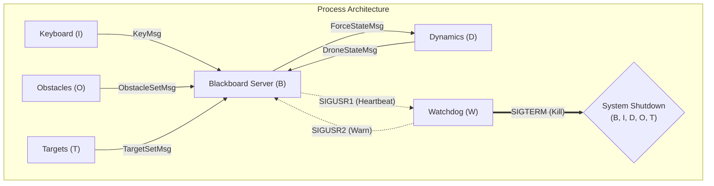

# Architectural Documentation

This project implements a simple 2D drone simulator using multiple POSIX processes and IPC primitives. The Master process initializes the simulation, creates communication pipes, and forks five child processes: **Keyboard (I)**, **Dynamics (D)**, **Obstacles (O)**, **Targets (T)**, and **Watchdog (W)**. After forking, the Master process transitions into the **Server (B)** process. The server aggregates user input, environment information and simulation state, computes total forces (including wall and obstacle repulsion), and updates a User-Interface using `ncurses`.

# 1- Architecture Sketch


# 2. Active Components — Definitions, IPC, and Algorithms

## 2.1 Keyboard Process (I)
- Role: Reads keystrokes from the user and forwards them to the Server.
- IPC: Sends `KeyMsg → B` (pipe)
- Behaviour:
    - Blocking read using `getchar()`
    - Sends every keystroke immediately
    - Supports directional cluster:
                w   e   r
                s   d   f
                x   c   v
    - Special keys:
    - `d` → brake (zero force)
    - `p` → toggle pause
    - `R` → reset drone
    - `q` → quit all processes

## 2.2 Server / Blackboard Process (B)
- Role: Main coordinator. Manages all IPC, world state, UI, scoring, environment logic.
- IPC:
    - Reads `KeyMsg` from I  
    - Reads `DroneStateMsg` from D  
    - Reads `ObstacleSetMsg` from O  
    - Reads `TargetSetMsg` from T  
    - Writes `ForceStateMsg` to D  
    - Uses `select()` to wait on multiple pipes
- Algorithms / Responsibilities:
    - User Force Handling
        - Updates accumulated user force from key cluster
        - Brake (`d`) resets force to zero
        - Pause freezes the simulation
    - Virtual-Key Obstacle Repulsion  
        - Compute continuous obstacle repulsive vector
        - Project onto 8 key directions
        - Select maximum positive projection
        - Convert magnitude to virtual key impulses
        - Update force accordingly
    - Target & Obstacle Filtering
        B ensures valid spawning:
        **Targets rejected if:**
        - too close to walls
        - too close to active obstacles

        **Obstacles rejected if:**
        - too close to active targets
        - new batch arrives while old ones still active
    - Target Hit Detection / Scoring
        If drone gets within `R_hit` of a target:
        - target deactivates  
        - score increments  
        - last-hit time updated  
    - World Rendering (ncurses)
        - Left pane → world (drone, walls, obstacles, targets)
        - Right pane → telemetry + score
        - Top row → instructions
        - UI updates every cycle
    - Pause / Reset / Quit
        - Pause freezes: obstacles, targets, forces, physics
        - Reset: set drone to origin with zero velocity
        - Quit: clean shutdown of all processes

## 2.3 Dynamics Process (D)
- Role: Simulates drone physics in real time.
- IPC:
    - Reads `ForceStateMsg` from B  
    - Writes `DroneStateMsg` to B  
- Algorithms: Applies 2D dynamics:
    - Adds continuous Khatib wall-repulsion  
    - Handles reset command  
    - Uses `nanosleep(dt)` for real-time pacing

## 2.4 Obstacle Generator Process (O)
- Role: Periodically generates dynamic obstacles.
- IPC: Sends `ObstacleSetMsg → B`
- Algorithms:
    - Samples random positions in an inner safe box  
    - Enforces minimum spacing  
    - Assigns lifetime (`life_steps`)  
    - New waves only accepted when none active  

## 2.5 Target Generator Process (T)
- Role: Generates collectible targets.
- IPC:Sends `TargetSetMsg → B`
- Algorithms:
    - Samples target positions in a central disk  
    - Applies spacing constraints  
    - B further filters targets:
        - too close to walls → reject
        - too close to obstacles → reject  

## 2.6 Parameter Module (`params.c`)
- Loads simulation parameters from `params.txt`:
    - mass, visc, dt  
    - force_step  
    - world_half  
    - spawn timings & clearances  

## 2.7 Utility Module (`util.c`)
- Shared helpers:
    - `check_target_hits()` for scoring  
    - distance filtering functions  
    - random sampling helpers  
    - direction-vector utilities for virtual keys 
    - generic logging handlers for processes


## 2.8 Watchdog Process (W)
- **Role**: System Health Monitor. Ensures the simulation is running responsively.
- **Design ("Chain of Trust")**: 
    - The Server (B) sends a heartbeat `SIGUSR1` to Watchdog (W) **only** after receiving a valid state update from Dynamics (D).
    - This effectively monitors the **Physics Loop**: if D freezes, B stops receiving updates, stops sending heartbeats, and W triggers a reset/warning.
- **IPC**:
    - **Input**: `SIGUSR1` from Server (B) (Heartbeat)
    - **Output**: 
        - `SIGUSR2` to B (Warning)
        - `SIGTERM` to All Processes (System Kill)
- **Algorithms**:
    - Monitors time since last heartbeat.
    - If silence > 2s: Warns B (triggers **blinking UI banner** with a **countdown timer**). The warning is cleared if the system resumes.
    - If silence > 10s: Terminates the entire system.
    - The timeout values are configurable in `params.txt`.

## 3 File Organization

### 3.1 File Structure

```text
proj_DroneGame/
│
├── src/          <-- Source files (.c)
│   ├── main.c           # Entry point
│   ├── server.c         # Blackboard server
│   ├── dynamics.c       # Physics simulation
│   ├── keyboard.c       # Input handling
│   ├── obstacles.c      # Obstacle generation
│   ├── targets.c        # Target generation
│   ├── watchdog.c       # System monitor
│   ├── params.c         # Config loader
│   └── util.c           # Utilities
│
├── headers/      <-- Header files (.h)
│   ├── server.h
│   ├── dynamics.h
│   ├── keyboard.h
│   ├── obstacles.h
│   ├── targets.h
│   ├── watchdog.h
│   ├── params.h
│   ├── util.h
│   └── messages.h
│
├── build/        <-- Compiled object files (.o)
│
├── logs/         <-- Runtime logs
│
├── install/      <-- Installation scripts
│
├── Makefile
├── README.md
└── Architecture.md
```


### 3.2 Source Files
-   `main.c`: Entry point. Handles parameter loading, pipe creation, and process forking.
-   `server.c`: Implementation of the Server (B) process logic and UI.
-   `dynamics.c`: Implementation of the Dynamics (D) process physics loop.
-   `keyboard.c`: Implementation of the Keyboard (I) process.
-   `obstacles.c`: Implementation of the Obstacles (O) generator.
-   `targets.c`: Implementation of the Targets (T) generator.
-   `watchdog.c`: Implementation of the Watchdog (W) process.
-   `params.c`: Helper functions for loading and initializing simulation parameters.
-   `util.c`: Shared utility functions (math, logging, helpers).

### 3.3 Headers (`./headers/`)
*   `server.h`: Server definitions.
*   `dynamics.h`: Dynamics definitions.
*   `keyboard.h`: Keyboard definitions.
*   `obstacles.h`: Obstacles definitions.
*   `targets.h`: Targets definitions.
*   `watchdog.h`: Watchdog definitions.
*   `params.h`: Parameter definitions.
*   `util.h`: Utility definitions.
*   `messages.h`: IPC message structures.

### 3.4 Configuration
-   `params.txt`: Runtime configuration of drone parameters (can be modified in real-time).
-   `logs/`: Directory housing runtime logs for each process (e.g., `server.log`, `dynamics.log`, `watchdog.log`).

#### 3.5 Build & Documentation
*   `Makefile`: Build configuration.
*   `README.md`: Project overview.
*   `Architecture.md`: System architecture documentation.
