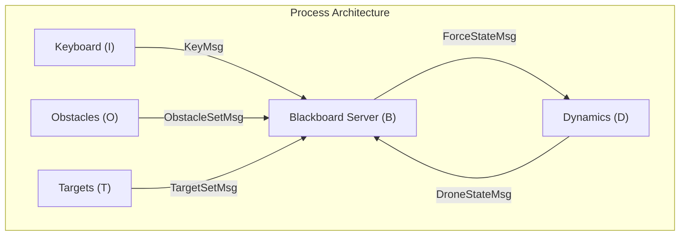

# Architecture Documentation

## Architecture Sketch

The application follows a multi-process architecture orchestrated by a **Master** process. The Master process initializes the simulation, creates communication pipes, and forks four child processes: **Keyboard (I)**, **Dynamics (D)**, **Obstacles (O)**, and **Targets (T)**. After forking, the Master process transitions into the **Server (B)** process.


## Component Definitions

### 1. Master / Server (B)
-   **Role**: The central "Blackboard" and User Interface.
-   **Functionality**:
    -   Initializes simulation parameters and resources.
    -   Manages the global game state (drone position, score, obstacles, targets).
    -   Renders the UI using `ncurses` (game world and inspection panel).
    -   Multiplexes I/O using `select()` to handle inputs from all other processes.
    -   Computes "Virtual Forces" for obstacle avoidance and sends commands to Dynamics.
-   **Primitives**: `fork()`, `pipe()`, `select()`, `ncurses`.
-   **Algorithms**:
    -   **Force Calculation**: Aggregates user input and repulsive forces from obstacles/walls.
    -   **Collision Detection**: Checks drone proximity to targets and obstacles.

### 2. Dynamics (D)
-   **Role**: The Physics Engine.
-   **Functionality**:
    -   Maintains the physics state of the drone (position, velocity).
    -   Receives force commands from the Server.
    -   Computes wall repulsion forces locally.
    -   Integrates the equations of motion to update state.
    -   Sends updated state back to the Server.
-   **Primitives**: `read()`, `write()`, `nanosleep()`.
-   **Algorithms**:
    -   **Euler Integration**: Updates velocity and position based on total force ($F_{total} = F_{user} + F_{wall} - K \cdot v$) and time step $dt$.

### 3. Keyboard (I)
-   **Role**: Input Driver.
-   **Functionality**:
    -   Captures raw keyboard input from the user.
    -   Sends key codes to the Server.
-   **Primitives**: Standard I/O.

### 4. Obstacles (O)
-   **Role**: Content Generator.
-   **Functionality**:
    -   Periodically generates sets of random obstacles.
    -   Sends obstacle data (position, lifetime) to the Server.
-   **Primitives**: `rand()`, `sleep()`.

### 5. Targets (T)
-   **Role**: Content Generator.
-   **Functionality**:
    -   Periodically generates sets of random targets.
    -   Sends target data (position, lifetime) to the Server.
-   **Primitives**: `rand()`, `sleep()`.

## List of Components and Files

### Components
The system is composed of the following active components:

1.  **Master / Server (B)**: The central hub handling game state, UI, and communication.
2.  **Dynamics (D)**: Physics engine calculating drone movement.
3.  **Keyboard (I)**: Captures user input.
4.  **Obstacles (O)**: Generates obstacles.
5.  **Targets (T)**: Generates targets.

### File Structure

```text
.
├── Architecture.md
├── Makefile
├── README.md
├── headers
│   ├── dynamics.h
│   ├── keyboard.h
│   ├── messages.h
│   ├── obstacles.h
│   ├── params.h
│   ├── server.h
│   ├── targets.h
│   └── util.h
├── keyboard.c
├── dynamics.c
├── log.txt
├── main.c
├── obstacles.c
├── params.c
├── params.txt
├── server.c
├── targets.c
└── util.c
```


### Source Files
-   `main.c`: Entry point. Handles parameter loading, pipe creation, and process forking.
-   `server.c`: Implementation of the Server (B) process logic and UI.
-   `dynamics.c`: Implementation of the Dynamics (D) process physics loop.
-   `keyboard.c`: Implementation of the Keyboard (I) process.
-   `obstacles.c`: Implementation of the Obstacles (O) generator.
-   `targets.c`: Implementation of the Targets (T) generator.
-   `params.c`: Helper functions for loading and initializing simulation parameters.
-   `util.c`: Shared utility functions (math, logging, helpers).

#### Headers (`./headers/`)
*   `server.h`: Server definitions.
*   `dynamics.h`: Dynamics definitions.
*   `keyboard.h`: Keyboard definitions.
*   `obstacles.h`: Obstacles definitions.
*   `targets.h`: Targets definitions.
*   `params.h`: Parameter definitions.
*   `util.h`: Utility definitions.
*   `messages.h`: IPC message structures.

### Configuration
-   `params.txt`: Runtime configuration file for simulation parameters (Mass, Viscosity, Time step, etc.) (can be modified in real-time).
-   `log.txt`: Log file kept aside with redirected instantaneous values from the inspection window.

#### Build & Documentation
*   `Makefile`: Build configuration.
*   `README.md`: Project overview.
*   `Architecture.md`: System architecture documentation.
